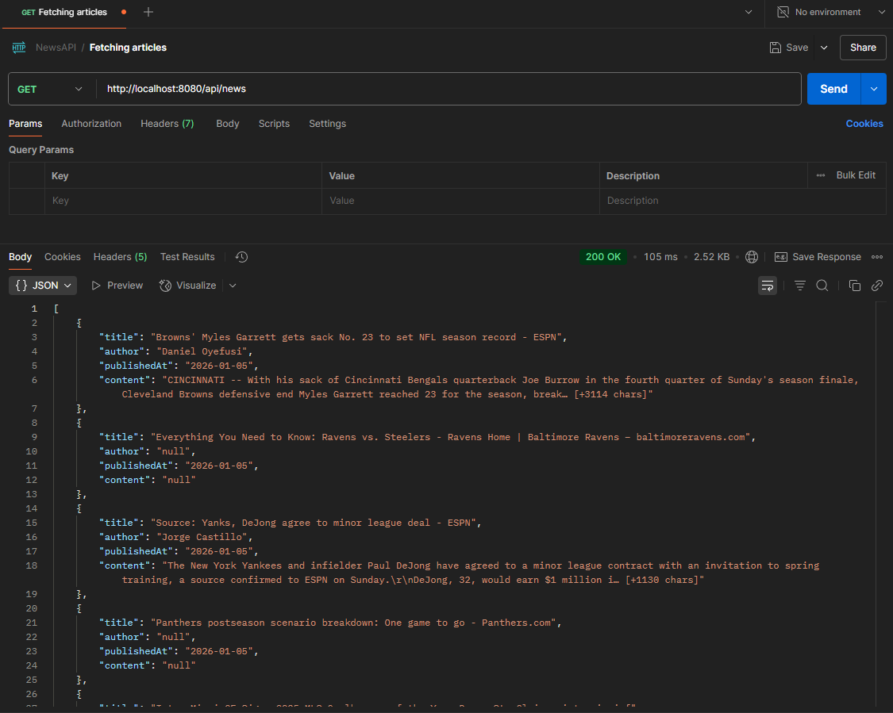
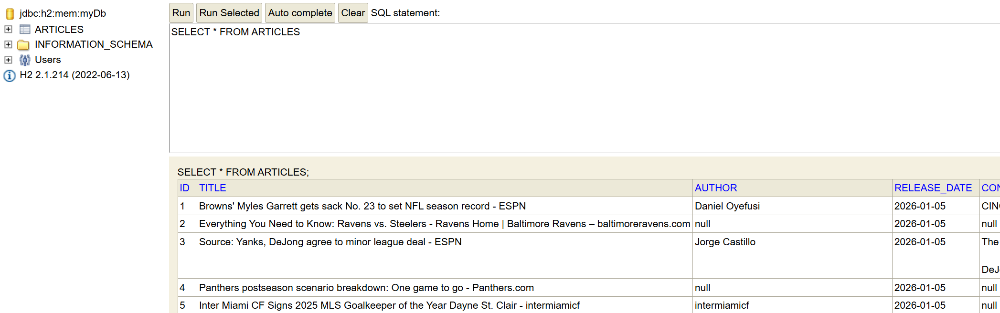
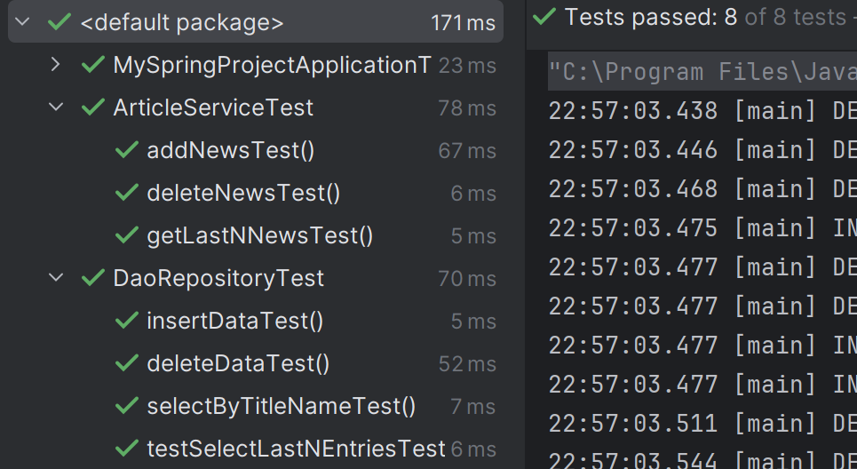

## About the Project

This project was created in **2022** as part of my very first job application process. At the time, I had no prior experience with backend frameworks, Spring Boot was entirely new to me, and I had just one week to learn it and build a functional application.

As a result, this is a simple project, designed to demonstrate fundamental backend concepts. It showcases:

- Basic **dependency injection**
- A clear **layered architecture** (Data Access, Business Logic, Presentation)
- **Scheduled tasks**
- **Unit testing**

The application periodically fetches articles from a **public news API**, processes the response, and stores the data in an **in-memory H2 database**. A `Dockerfile` and `docker-compose.yml` are included to make the project easy to run in a containerized environment.

This repository has been preserved and updated mainly to reflect my early software development journey.

---

## Technologies Used

- **Java 17** (also tested with Java 21)
- **Spring Boot**
- **Maven**
- **JUnit Jupiter**
- **H2 Database** (in-memory)
- **JDBC** (raw SQL for CRUD operations)
- **Flyway** (database migrations)
- **Docker & Docker Compose**

---

## Running the Project

You can run the project either locally or using Docker.

### Option 1: Run Locally

1. Install **JDK 17** (Java 21 also works).
2. Open the project in your preferred IDE.
3. Ensure the JDK is correctly configured.
4. Run the Spring Boot application.

### Option 2: Run with Docker

1. Make sure **Docker** and **Docker Compose** are installed.
2. From the project root, run:
    ```bash
    docker compose up -d
    ```
3. This will build the image and start the application container.

---
### Accessing the Application
#### API Endpoints
There is no traditional UI. The API can be tested using tools such as Postman, Bruno, or similar REST clients.
**GET** `/api/news`
**DELETE** `/api/news`

<div style="text-align: left;">  </div>

#### H2 Database Console

The in-memory H2 database console is available at:

URL: http://localhost:8080/h2-console
Use the following credentials:
* JDBC URL: jdbc:h2:mem:myDb
* Username: sa
* Password: (empty)

<div style="text-align: left;">  </div>

#### Running Unit Tests

Unit tests can be run directly from your IDE or via Maven.

<div style="text-align: left;">  </div>

_Madrid Babajev (2.05.2026)_